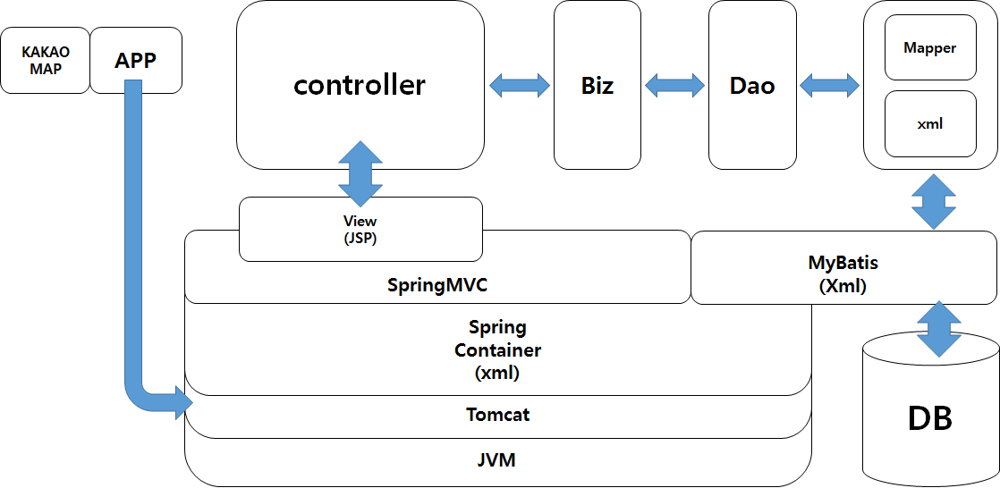
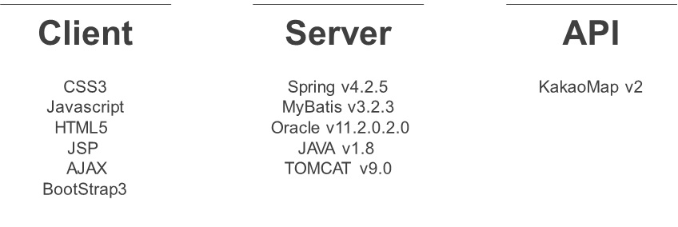
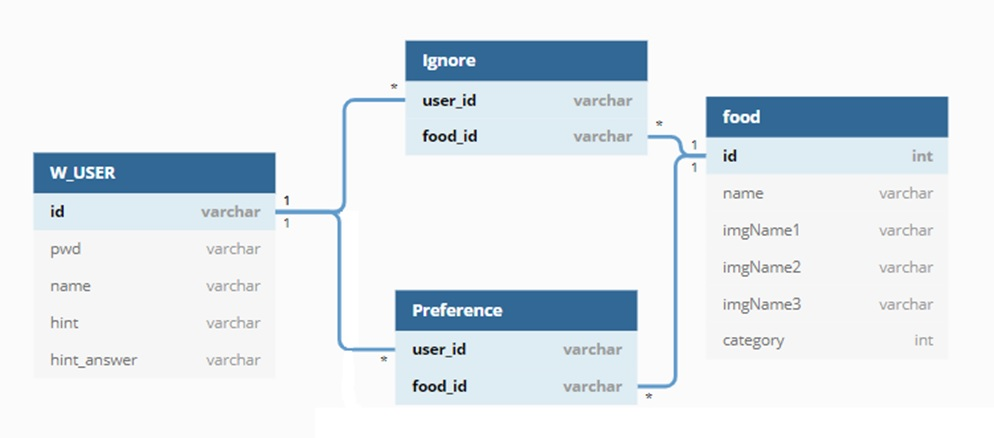
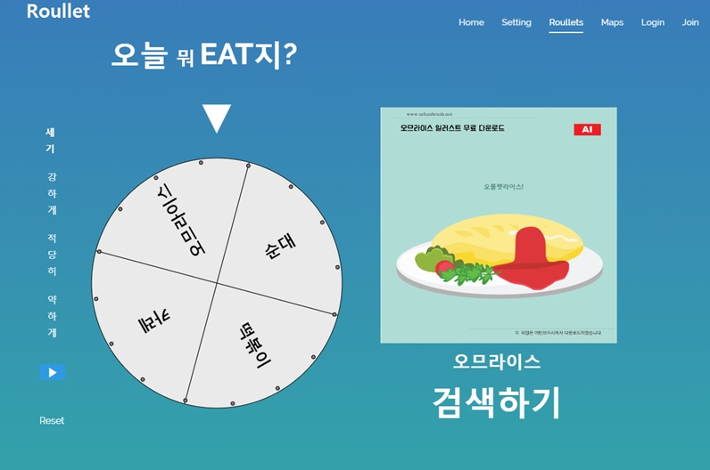
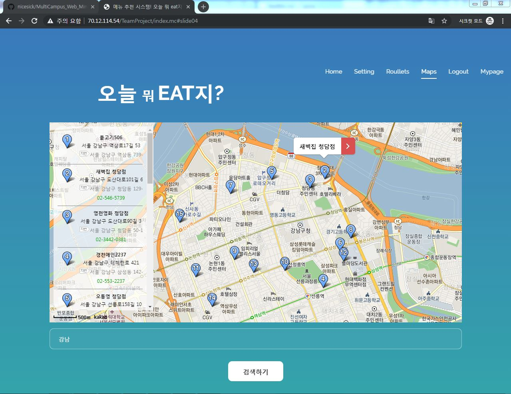
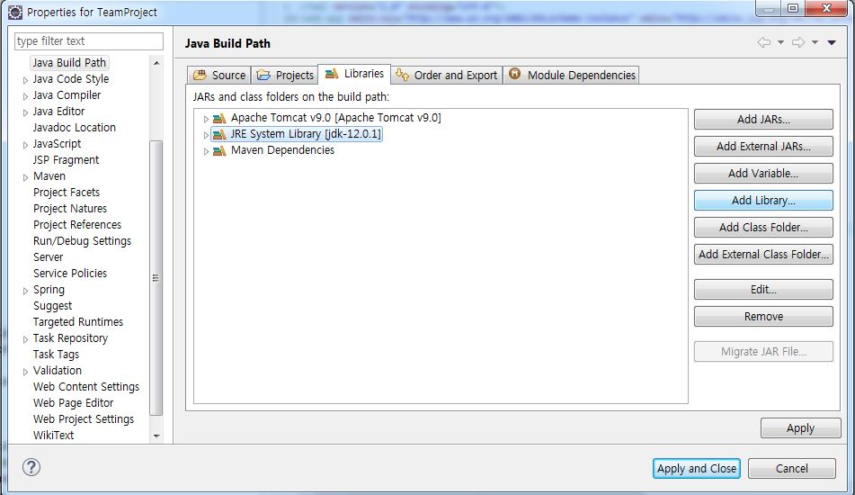
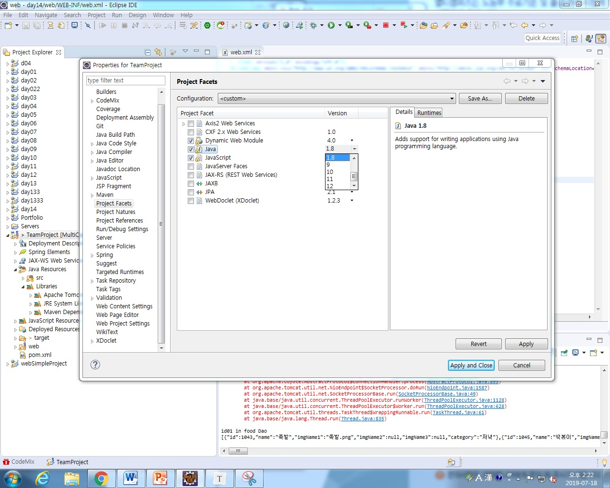

# :star::star::star:TeamProject_Team_3:star::star::star:

## I. Introduction

- **SpringMVC 를 활용한** 메뉴 추천 시스템
  - 식사 시간만 되면 고민하셨죠?
  - **오늘 뭐 먹지?**
  - 이제, 저희가 결정해드립니다.

## II. 시스템 구성

  

- 사용기술

  

  

## III. ERD

- 

## IV. UI

- 룰렛화면

  

- 카카오 맵 API를 이용한 지도

  

## V. How to install

- Build Path 에 설치되어 있는 Java library 추가

- Project Facets에 있는 Java Version 수정(Tomcat 에 들어갈 수 있게!)

  

